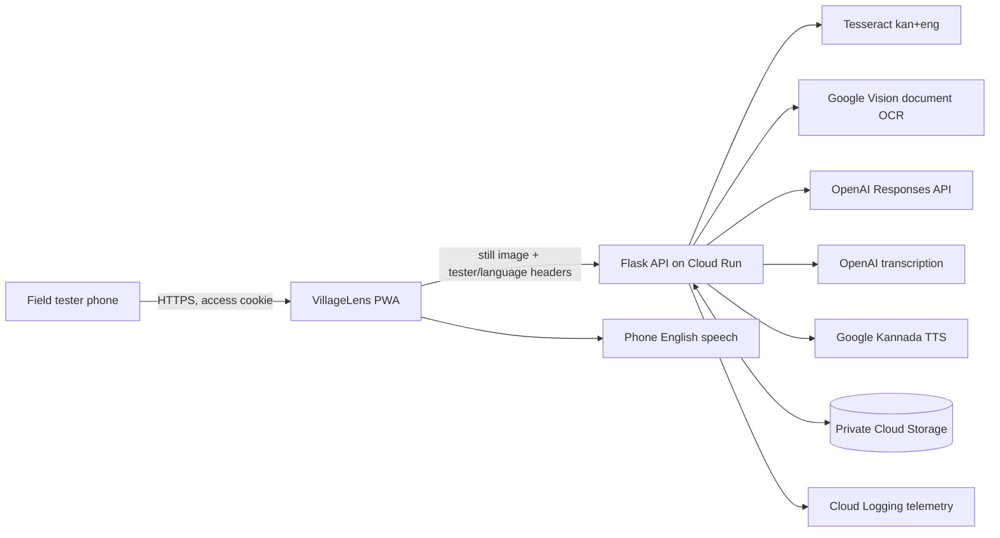
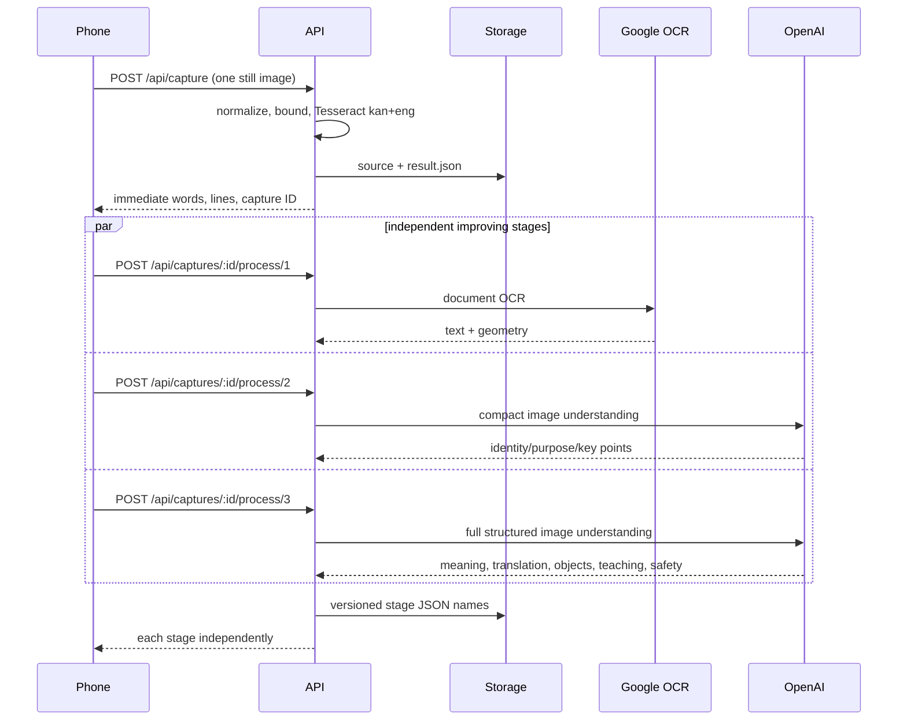

# VillageLensAI current architecture

Status: as built and deployed on 2026-09-12. This document describes the
running proof of concept, not the proposed lower-cost model cascade. Historical
deployment records in this directory explain how individual capabilities
arrived.

## Product boundary

VillageLensAI is a still-image reading and learning assistant designed first
for Kannada-speaking adults with low literacy. It also has an isolated
English-output experiment for a reviewer. The phone experience deliberately
hides provider names and exposes improving evidence through colored stages.

The current proof of concept includes:

- a Kannada-first progressive web app at `/a/`;
- an English-output experiment at `/b/`;
- guided still-image capture, gallery navigation, touch reading, continuous
  reading, translation, contextual inference, spoken questions, and Kannada
  audio;
- anonymous field cohorts `A1` through `A10`, with `A3` as the reviewer;
- private retained captures and reusable reader evidence; and
- server-side OCR and multimodal inference on Google Cloud Run.

Continuous video, phone-wide app control, model training, medical diagnosis,
and production-scale multi-tenant operation are outside the current boundary.

## System context



Production runs in Google Cloud project `villagelensai`, Cloud Run service
`vlens-a`, region `us-central1`. The controlled POC keeps minimum instances at
zero, maximum instances at one, and provider credentials in Secret Manager.

## Client architecture

The `/a/` client is a single phone-oriented HTML application with an installable
web manifest and service worker.

### Entry and identity

- `/` redirects to the access flow when the gate is configured.
- `/access` accepts an anonymous tester ID and shared access code.
- A helper can instead send a signed, per-tester WhatsApp enrollment link. Its
  token is placed in the URL fragment, exchanged by `POST /access/link`, and
  removed from browser history before the reader opens.
- The signed access cookie lasts 30 days and is `Secure`, `HttpOnly`, and
  `SameSite=Lax`.
- The tester cookie retains the assigned `A1`-`A10` cohort for `/a/`.
- `A3` is the reviewer and can see captures across cohorts. Other users see
  their own retained captures, bounded to the newest 20 plus two demos.

### Capture

The guided camera uses `getUserMedia` when available and falls back to the
phone's file/camera picker. The visible guide is deliberately object-neutral:
it can frame a page, label, plant, appliance, or other object.

The client measures approximate brightness, glare, sharpness, and motion in the
guide region. Capture remains manual. When the user presses the camera button,
the browser samples a four-frame burst, selects the strongest frame, crops to
the visible guide, encodes a JPEG, and sends capture-quality metadata with the
image. This reduces button-press shake without claiming that an orange frame is
unreadable.

### Reading and interaction

- Touch modes select a word, sentence, translation, or camera action.
- Action controls continuously read words or sentences, request global or
  regional inference, record a spoken question, and install the PWA.
- Only one reading/action control remains active at a time. Starting another
  stops current playback.
- Recognized word, line, object, evidence, and spoken-section boxes are rendered
  over the displayed image so touch and audio can remain grounded.
- The microphone records audio, displays recording/processing state and elapsed
  time, transcribes it server-side, and sends conversation history plus an
  optional selected region.
- Kannada speech is returned by the authenticated `/api/speech` endpoint.
  English speech uses the phone voice.

The service worker skips waiting, claims existing clients, announces application
updates, and implements the Android/PWA image share target. The HTML, manifest,
and service worker are revalidated so field users do not need a hard refresh.

## Capture and evidence flow



The source image is uploaded once. Retained-stage endpoints reload the private
source rather than asking the phone to upload it for every reader. Locks prevent
duplicate processing of the same capture, stage, and language within one
instance.

## Current evidence stages

The browser currently displays three bars because Astra is paused.

| Bar | Current implementation | State and output |
|---|---|---|
| 1 | Repository-pinned Tesseract `kan+eng`, strengthened by Google Vision document OCR | Words, lines, mixed-script geometry and immediate reading |
| 2 | `gpt-5.6-sol`, Fast service tier, compact `instant-v2` contract | Fast identity, purpose, up to three useful details, confidence |
| 3 | `gpt-5.6-sol`, Fast service tier, full `context-v2` contract | Translation, scene meaning, objects, handwriting/page teaching, numbers, units, safety and uncertainty |
| 4 | Formerly `gpt-6-astra` independent review | Disabled server-side and hidden; direct calls are rejected before provider use |

“Instant” is an application contract, not a cheaper OpenAI model. Bars 2 and 3
currently use the same Sol model with different output schemas and budgets.

The planned cost-controlled cascade—Luna, Terra, then selective standard-tier
Sol—is a target architecture and must be evaluated before promotion.

## Structured inference contract

The full multimodal result is validated before use and includes:

- scene identity and purpose;
- simple spoken summary and detailed explanation;
- important points, action, warning, uncertainty, and confidence;
- English-to-Kannada translations or any-script-to-English output;
- selectable object regions and spoken teaching sections tied to image regions;
- handwriting transcription with uncertain-line marking; and
- preservation and explanation of joined values such as `110V`, `50Hz`, and
  `2 HP`.

The model is instructed to abstain rather than invent obscured text, diagnoses,
species, electrical instructions, or missing page content. A completed request
is evidence availability, not proof of correctness.

## Kannada-first and English-output modes

The browser sends `X-VillageLens-Output-Language` with `kn` for `/a/` and `en`
for `/b/`. Kannada remains the field-test default. English reader evidence is
stored under distinct `stage-N-en.json` names, so testing `/b/` does not replace
Kannada evidence.

The translation endpoint explains short visible labels in the selected output
language. Kannada TTS uses Google `kn-IN-Standard-A`; unique speech strings are
stored under SHA-256-derived private cache names. No field user must install a
Kannada phone voice.

## Storage model

Private bucket `villagelensai-captures` stores:

```text
captures/<capture-id>/source
captures/<capture-id>/result.json
captures/<capture-id>/stage-1.json
captures/<capture-id>/stage-2.json
captures/<capture-id>/stage-3.json
captures/<capture-id>/stage-N-en.json
captures/<capture-id>/stage-N-failure.json
speech/v1/<sha256>.mp3
```

The internal capture ID is random and stable. The UI derives memorable
per-tester chronological labels such as `A2-7`; it does not rename stored
objects. Cached evidence is accepted only when its output language, model role,
and analysis version match current code. A five-minute failure record prevents
phones from repeatedly spending money during provider failures.

## API surface

| Route | Purpose |
|---|---|
| `GET/POST /access`, `POST /access/link` | Access gate and passwordless cohort enrollment |
| `GET /a/`, `GET /b/` | Kannada-first and English-output clients |
| `GET /health` | Tesseract, access-gate and optional-reader readiness |
| `POST /api/capture` | Normalize, retain and return immediate Tesseract result |
| `GET /api/gallery` | Authorized demos, captures and reusable stage evidence |
| `GET /api/captures/:id/image` | Authorized private image retrieval |
| `POST /api/captures/:id/process/:stage` | Idempotent retained-image stage processing |
| `POST /api/read/:stage` | Non-retained/demo stage processing |
| `POST /api/translate` | Short-label translation/explanation |
| `POST /api/speech` | Cached Kannada speech synthesis |
| `POST /api/captures/:id/ask` | Typed contextual image question |
| `POST /api/captures/:id/ask-audio` | Transcribed contextual image question |
| `POST /api/events` | Bounded interaction telemetry without recognized text |

## Security, privacy, and operational controls

- API keys, access code, and cookie-signing secret remain server-side.
- Captures and APIs require the access cookie; reviewer access is explicit.
- API and access responses are `no-store`; the main application page is also
  served with revalidation headers.
- Allowed upload formats are JPEG, PNG and WebP, with byte, pixel and edge
  limits before inference.
- CORS is denied unless an origin is explicitly configured.
- Security headers disable MIME sniffing and referrer leakage.
- Provider requests use `store: false` where supported.
- Telemetry records event name, anonymous tester ID, capture ID, success and
  elapsed time. It does not intentionally log recognized text, questions,
  answers, photographs, credentials, or provider payloads.
- Cloud Run failures and request timing are available in Cloud Logging.

## Known constraints and active risks

1. Bars 2 and 3 duplicate Sol-class image processing and currently request the
   Fast tier, which is costly relative to the field workload.
2. Historical provider usage was not retained per capture; exact per-user token
   cost requires new response-usage accounting.
3. Google Gemini model experiments have not been reliable enough for production;
   authentication, quota, model availability and runtime reliability must be
   evaluated separately.
4. OCR and inference remain sensitive to distant handwriting, curvature,
   clipping, glare and device-specific capture behavior.
5. Kannada text quality and Kannada speech pronunciation are distinct quality
   problems and require separate human evaluation.
6. Browser installation and Android share targets improve access but cannot
   provide general control of WhatsApp or other phone applications.
7. One Cloud Run instance and in-memory locks are deliberate POC limits, not a
   horizontally scalable production design.

## Promotion boundary

Experimental providers, local models, prompts, and trained adapters belong in
the isolated `villagelens-model-eval` project. A capability enters this
repository only after frozen-dataset evaluation, field-language review,
cost/latency measurement, shadow testing, behavioral tests, and a recorded
rollback plan.
